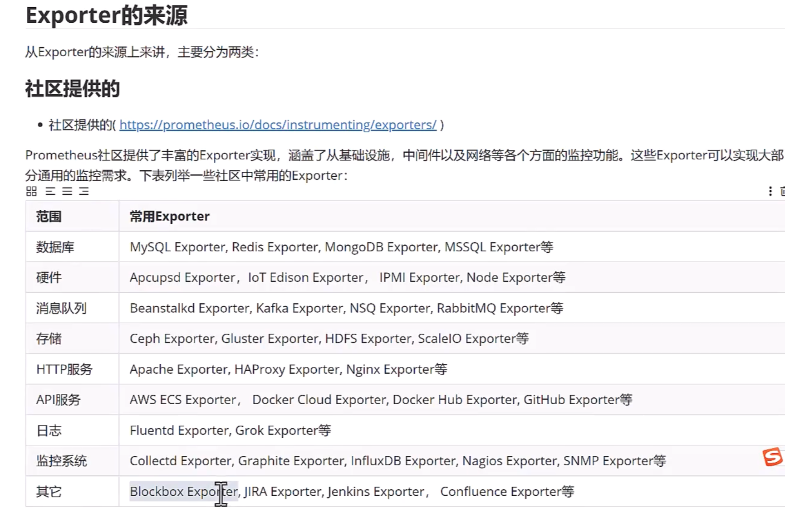

# prometheus 构建监控，告警，注册中心

进入mysql容器

```shell
docker exec -it mysql8.0 mysql -u root -p

mysql> create user 'exporter'@'%' IDENTIFIED BY 'password' WITH MAX_USER_CONNECTIONS 3;
Query OK, 0 rows affected (0.03 sec)

mysql> GRANT PROCESS, REPLICATION CLIENT, SELECT ON *.* TO 'exporter'@'%';
Query OK, 0 rows affected (0.00 sec)
```

重新加载 prometheus 配置

```shell
curl -X POST http://localhost:9090/-/reload
```

检查 prometheus 配置

```shell
docker exec -it prometheus promtool check config /etc/prometheus/prometheus.yml
```

mangodb rabbitmq nginx redis 监控

```shell
# mongodb 服务启动
见 mongo-exporter 文件夹

docker run -d --name="mongodb" -p 27017:27017 -p 28017:28017 -e MONGODB_PASS="mypass" mangoraft/mongodb-arm 

docker exec -it mongodb mongo admin -u admin -p mypass

docker run -d --name="mongodb" -p 27017:27017 -p 28017:28017 -e MONGO_INITDB_ROOT_USERNAME="admin" -e MONGO_INITDB_ROOT_PASSWORD="mypass" mongo:4.2.5

# 创建mongo 用户
> db.createUser({ user:'exporter', pwd:'password',roles:[{role:'readAnyDatabase', db:'admin'},{role:"clusterMonitor", db:"admin"}]})

> db.auth('exporter','password')

# rebbitmq 服务启动
docker run -d --name rabbitmq -p 5672:5672 -p 15672:15672 -e RABBITMQ_DEFAULT_USER=user -e RABBITMQ_DEFAULT_PASS=password  rabbitmq:3.7.15-management

# redis 服务启动
docker run -d --name redis -p 6379:6379 redis:5 redis-server --requirepass 123456 --manmemory 512mb

# 配置nginx 接口信息
location /stub_status{
    stub_status on;
    access_log off;
    allow 0.0.0.0/0;
    deny all;
}


# 配置redis exporter docker启动
docker run -d --name redis_exporter -p 9121:9121 oliver006/redis_exporter --redis.addr redis://host.docker.internal:6379 --redis.password '123456'

# 配置 rabbitmq exporter docker启动
docker run -d --name rabbitmq_exporter -p 9419:9419 -e RABBIT_URL=http://localhost:15672 -e RABBIT_USER=guest -e RABBIT_PASSWORD=guest kbudde/rabbitmq-exporter 


# 配置 系统进程监控 process exporter
cat >>process.yml <<"EOF"
process_names:
  - name: "{{.Come}}" # 匹配模版
    cmdline:
    - '.+'  # 匹配所有名称
EOF

docker run -d --rm -p 9256:9256 --privileged -v /proc:/host/proc -v `pwd`:/config --name process-exporter ncabatoff/process-exporter -- procfs /host/proc -config.path /config/process.yml

# 黑盒监控
白盒监控" - 需要把对应的Exporter程序安装到被监控的目标主机上，从而实现对主机各种资源及其状态的数据采集工作。
但是由于某些情况下操作技术或其他原因，不是所有的Exporter都能部署到被监控的主机环境中，最典型的例子是监控全国网络质量的稳
定性，通常的方法是使用ping操作，对选取的节点进行ICMP测试，此时不可能在他人应用环境中部署相关的Exporter程序。针对这样的
应用的场景，Prometheus社区提供了黑盒解决方案，Blackbox Exporter无须安装在被监控的目标环境中，用户只需要将其安装在与
Prometheus和被监控目标互通的环境中，通过HTTP、HTTPS DNS、TCP、ICMP等方式对网络进行探测监控，还可以探测SSL证书过期
时间。

blackbox_exporter
- Prometheus 官方提供的 exporter之一，可以提供 http、dns. tcp、icmp 的监控数据采集


# 域名监控

docker run -d --name domain_exporter --restart=always -p 9222:9222 caarlos0/domain-exporter
```



## 基于 consul 的服务发现

docker 运行

```shell
docker run -d --name=consul -p 8500:8500 consul:1.14.5
```
